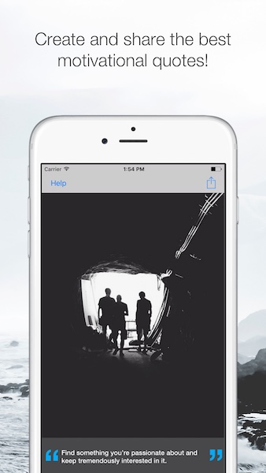

# inspiration

Simple Inspiring pictures generator app written in Swift 3 for iOS with watchOS support.

<h3 align="center">

</h3>

## Compatibility

This project is written in Swift 3.1 and Xcode 8.3.2.

## Available on
iPhone, iPad, iPad, Apple Watch

<h3 align="left">

</h3>

## Tools
1. API integration - [unsplash.com](https://unsplash.com/developers) and [quotesondesign.com](http://quotesondesign.com/api-v4-0/)
2. Storyboards, Auto Layout  
3. Frameworks - Foundation, UIKit, WatchKit, WatchConnectivity  
4. SwiftLint

## Author

* [Konstantin Khokhlov](https://ru.linkedin.com/in/const)

## License

Copyright 2017 Konstantin Khokhlov.

Licensed under MIT License: https://opensource.org/licenses/MIT
